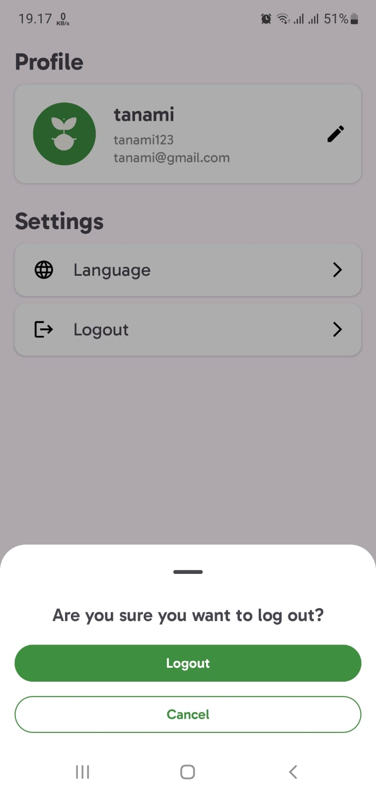

# Tanami Android Application

An intuitive Android client application that provides plant recommendations based on soil type.

## Features
- Soil classification for precise plant recommendations.
- Integration with weather data for optimized advice.
- Real-time location-based suggestions.

## Technology Stack
- **Kotlin**: Primary programming language for Android development.

## Tools and Frameworks
- **Navigation Component**: Streamlined in-app navigation.
- **Lifecycle**: Efficient lifecycle management.
- **LiveData & ViewModel**: Reactive UI and state management.
- **Retrofit**: Robust HTTP client for REST API integration.
- **Google Play Services**: Location-based features.
- **OpenWeatherAPI**: Weather data integration.
- **TensorFlow Lite**: Advanced soil classification using machine learning.
- **Coroutines**: Asynchronous programming for smooth user experience.
- **Glide**: Efficient image loading and caching.

## Utilities
- **Gson**: Easy JSON parsing.
- **OkHttp**: HTTP logging for debugging and performance monitoring.
- **Material Design**: Modern and consistent UI components.

## Storage
- **SharedPreferences**: Lightweight local storage for user preferences and small data.

## Download the App
[Download Tanami](https://github.com/capstone-Tanami/tanami-md/raw/refs/heads/main/tanami.apk)

Your Planting Partner, Anywhere, Anytime.

## Screenshot

|Splash Screen|Login|Register|
|--|--|--|
||||

|Home|Article|Generate|
|--|--|--|
||||

|Manual Predict|Image Predict|Result|
|--|--|--|
||||

|Community|Add Post|Detail Post|
|--|--|--|
||||

|Profile|Language|Logout|
|--|--|--|
||||

|Edit Profile|Edit Name|Edit Photo|
|--|--|--|
||||

|History|Detail History|
|--|--|
|||
